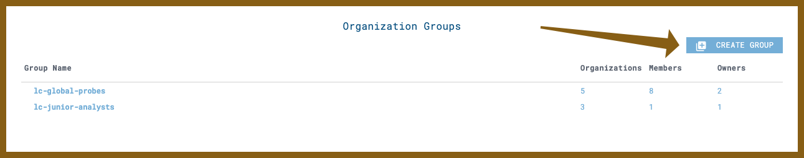

LimaCharlie employs a fine-grained permission scheme across the API and user accounts.

## User Access

Details on giving a new user initial access can be [found here]().

2FA is offered through the following technologies. NAtive 2FA is coming to LimaCharlie in 2021.
* Google 
* Microsoft
* Github

If you havew any questions or specific needs around user authentication please do not hesitate to [get in touch]().

## Analyst Permissions

Administrators can manage multiple analysts across multiple organizations. LimaCharlie provides a top-level user management scheme that allows for the creation of user groups with defined permissions across organizations.

Using this mechanism you can create groups of analysts with permissions that span multiple organizations which should drastically reduce the administration required and allow for fine grained access control.

Details on giving a new user initial access can be [found here](./user_access.md).

This feature set can be accessed through the web application at the top of the main dashboard. In the upper right corner you will see a new ‘Create Group’ button. Clicking on this will prompt you to name the new group.

<kbd></kbd>

Once you name the group you will see it show up in the list of groups. From here you can click on it, select the organizations, set permissions and add users. Users can be a mix of owners and members of various groups that have access to a variety of organizations with different permission levels - the possibilities are endless.

### Organization Groups
Organization Groups allow you to grant permissions to a set of users on a group of organizations.

Permissions granted through the group are applied on top of permissions granted at the organization level. Ther permissions are additive, and a group cannot be used to subsctract permissions granted at the organization level.

Organization Group Owners are allowed to manage the Organization Group, but are not affected by the permissions. Members are affected by the permissions but do not have the ability to modify the Organization Group.

## Programatic Access

LimaCharlie Cloud has a concept of API keys. Those are secret keys that can be created and named which can then in turn be used to retrieve a JWT.

Details on API Keys can be [found here](./api_keys.md).