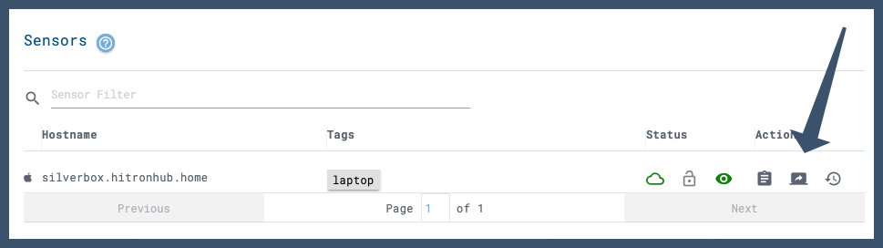
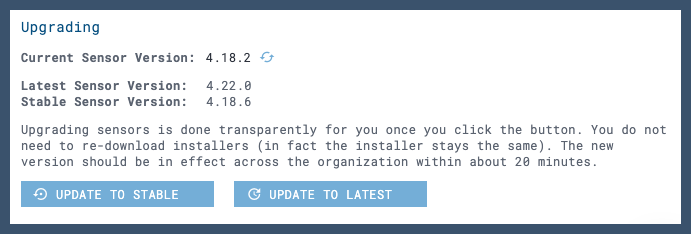

## <span style="color:#3e516b">Overview</span>

The LimaCharlie agent - or sensor - is fully interactive and can monitor over [70 different event types](./events.md). The agent is written in C and then compiled for each different platform and architecture it runs on which means is that it has true feature parity across all operating systems. The only exceptions are platform specific functions, such as monitoring Windows registry operations, etc. 

Various builds of the agent can run on the following for x86, ARM & MIPS architectures.

 * 32-bit Windows all way Back to Windows XP through to the most modern version of 64-bit Windows
 * All flavours of Linux both 32-bit and 64-bit 
 MacOS
 * Builds for Solaris and BSD can be produced on [request](https://limacharlie.io/user-ticket)
 
 LimaCharlie also provides a seperate agent for ChromeOS that can run stand alone or as a side-care to the main agent.

The agent is approximately 500kb in size but that varies a little depending on which platform it is compiled for. While running it consumes less that 1% CPU but does spike very briefly when certain events take place like an application starting up. LimaCharlie is able to pack so much power into such a small program because it treats the agent as an extension of the cloud by utilizing a true real-time persistent TLS connection. The round trip time from an event being detected to the time a response is actioned on the endpoint is generally less than 100 milliseconds.

Documentation on deploying the agent can be [found here](./deploy_sensor.md).

## <span style="color:#3e516b">Live View</span>

Authorized programs and scripts can interact with the LimaCharlie agent in real-time. Analysts can also interact with the agent in real-time using the web application. LimaCharlie's Live View provides a graphic based control panel into the endpoint.

Live View is accessed from the user interface of the web application under the Sensors tab.



The Live View user interface of the web application uses a tabbed format. Through each of the tabs an analysts has access to and can perform the following.

**Info Tab:** Users can view hostname, platform (OS), sensor ID, external IP, internal IP, last connected and is able to list and edit tags.

**Management Tab:** Froim this tab users can exercise fine-grained control over the type of telemetry from the endpoint that should be sent to the cloud. A full list of events that can monitored can be [found here](./events.md).

**Console Tab:** The console tab allows users to query the endpoint in real-time. A full list of sensor commands that can be sent the endpoint can be [found here](./sensor_commands.md).

**Feed Tab:** The feed tab allows users to view a live stream of events as they are happening on the endpoint. This is a computationally intensive process in the browser and should be closed when not being used. A full list of events that can be viewed through this user interface are [listed here](./events.md).

**Processes Tab:** The process tab allows users to see a list of processes running on the endpoint and perform several ppossible operations on each. For each process running on the endpoint the user can do the following.
* View Modules
* Kill Process
* Suspend Process
* Resume Process
* Memory Strings
* Memory Map
* Network Connections

**File System Tab:** Fron the file systems tab users can perform the following.
* Navigate the endpoint's file systems
* Download files from the endpoint
* Generate a hash for a given file and optionally check that hash against [VirusTotal](https://www.virustotal.com/)

**Network Tab:** The network tab will display the following for the given endpoint. The underlying mechanism is [netstat](https://linux.die.net/man/8/netstat).
* Process Name
* Local IP
* Local Port
* Foreign IP
* Foreign Port
* State
* Process Hash


## <span style="color:#3e516b">Installers</span>

### <span style="color:#3e516b">Downloads</span>

**Windows**

[Windows 32 bit](https://app.limacharlie.io/get/windows/32)

[Windows 64 bit](https://app.limacharlie.io/get/windows/64)

[Windows msi32](https://app.limacharlie.io/get/windows/msi32)

[Windows msi64](https://app.limacharlie.io/get/windows/msi64)

**MacOS**

[MacOS 64 bit](https://app.limacharlie.io/get/mac/64)

[MacOS pkg](https://app.limacharlie.io/get/mac/pkg)

**Linux**

[Linux 32 bit](https://app.limacharlie.io/get/linux/32)

[Linux 64 bit](https://app.limacharlie.io/get/linux/64)

[Linux alpine64](https://app.limacharlie.io/get/linux/alpine64)

[Linux arm32](https://app.limacharlie.io/get/linux/arm32)

[Linux arm64](https://app.limacharlie.io/get/linux/arm64)

[Docker](https://hub.docker.com/r/refractionpoint/limacharlie_sensor)

**Chrome/ChromeOS** 

[Chrome](https://app.limacharlie.io/get/chrome/)

### <span style="color:#3e516b">Installing</span>

Installing the sensor requires administrator (or root) execution:

**Windows EXE:** ```installer.exe -i YOUR_INSTALLATION_KEY```

**Windows MSI:** ```installer.msi WRAPPED_ARGUMENTS="YOUR_INSTALLATION_KEY"```

**MacOS:** ```chmod +x installer ; installer -i YOUR_INSTALLATION_KEY```

**Linux:** ```chmod +x installer ; installer -d YOUR_INSTALLATION_KEY```

**Note:** On Linux the exact persistence mechanism, like launchd, is left to the administrator, therefore the ```-d``` argument launches the sensor from the current working directory without persistence. The sensor does not daemonize itself.

**Note:** A sample installer script is [available here](https://github.com/refractionPOINT/lce_doc/blob/master/docs/lc_linux_installer.sh) that works on Debian and CentOS families.

**Chrome(+OS):** See our [documentation here]()


**Docker:** See our [documentation here]()

### <span style="color:#3e516b">Connectivity</span>

**Agent to cloud:** agents require accesss over port 443 using pinned SSL certificates (SSL interception is not supported)
0651b4f82df0a29c.lc.limacharlie.io

**Chrome Agent to cloud:** agents require accesss over port 443 using normal SSL certificates websockets
0651b4f82df0a29c.wss.limacharlie.io

**Artifact Collection ingestion:** agents require accesss over port 443 to ingest artifact
0651b4f82df0a29c.ingest.limacharlie.io

**Replay API:** agents do NOT require access
0651b4f82df0a29c.replay.limacharlie.io

## <span style="color:#3e516b">Upgrading</span>

Upgrading sensors is done transparently when the user clicks a button in the web application or through the API/SDK/CLI. Rolling back sensor versions can also be done with the click of a button in the web application or through the API/SDK/CLI. You do not need to re-download installers (in fact the installer stays the same). Once an upgrade has been triggered the new version should be in effect across the organization within about 20 minutes.


