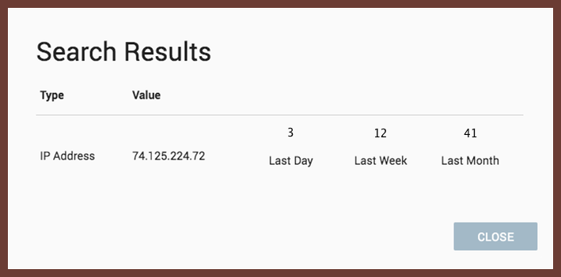
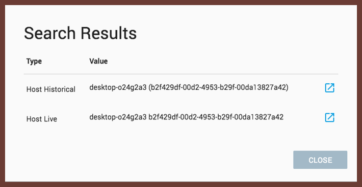
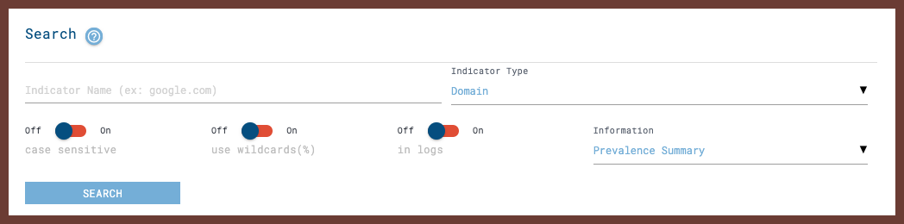

<!-- leave the empty title here... the image below displays the info BUT the platform requires something here -->
# 

LimaCharlie is information security tools and infrastructure. Infrastructure to support any scale and tools to help analysts get started hunting as they grow into the platform.

Several high-level topics around threat detection and mitigation are outlined below.

Questions or concerns can be directed to our user [ticket saystem]().

## Detection & Response Rules

[Detection & Response Documentation](./dr.md)

[D&R Rules Code Lab](./codelab_dr.md)

[Webinar Series: Intro to D&R Rules](https://www.youtube.com/watch?v=0bwgMPkfbFE&t=187s)

LimaCharlie also offers online training material which walks through the creation of D&R rules at [edu.limacharlie.io](https://edu.limachalire.io) 

## Targets

LimaCharlie has the concept of D&R targets and you can now create D&R rules that specifically target different log or file types ingested. This means that, for example, you can create your own regular expressions that if matching a log line from your web proxy logs, generates a Detection. 

The rules apply to any files ingested, from the unstructured text logs to the raw Windows Event Logs and PCAP.

Information on log and file ingestion can be found [here](./external_logs.md), and information on log specific DR rules can be found [here]./dr.md#targets).

## Search & Historical Threat Hunting

LimaCharlie provides several methods for searching out indicators of compromise.

Users can write D&R rules against historical telemetry and log files using the Replay mechanism which is documneted [here](./replay.md).

On any dashbaord for a given organization LimaCharlie provides a universal search field. From this interface users can search using a sensor ID, hostname prefix, IP address, hash, file path and more.

Searching for an IP, file path, hash or user name will bring back stats around the prevalence of the given datapoint. The prevalence is represented by three numbers indicating how many times the data point was seen on the given organization’s hosts over the last day, last week and last month. 

Searching for a sensor ID or hostname prefix will bring back links that lead directly into the live console or historical data explorer for the given sensor. These search results act a shortcut into full access of the endpoint and all of its historical telemetry.

LimaCharlie users can also perform more complex searching for common indicators of compromise across all historical data from the Search tab inside of the web applicaiton. You can query for the following kind of information:

**Prevalence Summary:** This will give you three metrics. The number of hosts where the indicator has been seen today, this week and this month. This is great to give you information at a glance about an indicator. For example, an executable seen twice today and never this week and this month is more suspicious than one seen over hundreds of hosts for the whole month.

**Locations:** This will show you where this indicator has been seen as well as the first and last time it was observed on each host. This is useful during the incident response process to scope where specific suspicious behavior has been observed.

## Community Resources

A full list of community resources made available through the LimaCharlie Add-On Marketplace can be found [here](./lc-marketplace).

### YARA

[YARA](https://virustotal.github.io/yara/) is a tool aimed at (but not limited to) helping malware researchers to identify and classify malware samples. With YARA you can create descriptions of malware families (or whatever you want to describe) based on textual or binary patterns. Each description, a.k.a rule, consists of a set of strings and a boolean expression which determine its logic.

Documentation on how to leverage YARA with LimaCharlie can be found [here](./yara.md).

### Sigma

[Sigma](https://github.com/Neo23x0/sigma) is a generic and open signature format that allows you to describe relevant log events in a straightforward manner. The rule format is very flexible, easy to write and applicable to any type of log file. The main purpose of this project is to provide a structured form in which researchers or analysts can describe their once developed detection methods and make them shareable with others.

Sigma is for log files what Snort is for network traffic and YARA is for files.

Documentation on how to leverage Sigma with LimaCharlie can be found [here]().

